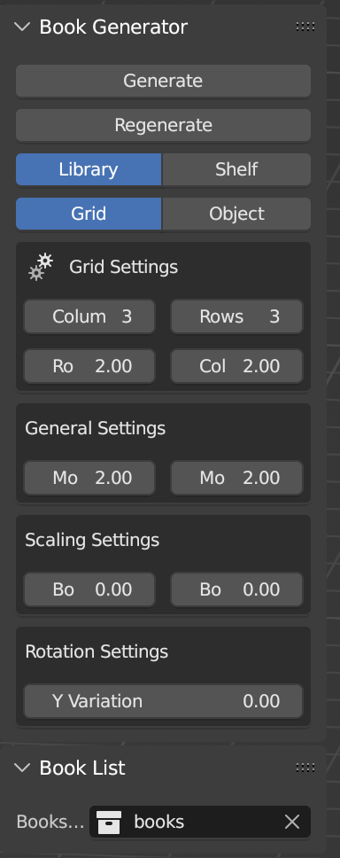
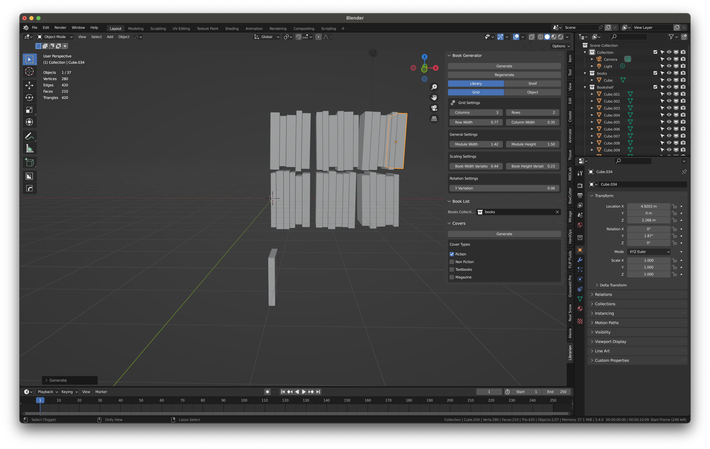

# Librarian

Librarian is a Blender addon to easily generate a library-like collection of book objects. This was the first Blender plugin I started to develop. In Blender 2.79 I had purchased a very similar plugin, but there was a major API overhaul introduced in version 2.80 and many plugins were left forgotten. I decided to use this opportunity to create an updated version of the plugin I had, as well as learn about how Blender plugins work. Unfortunately this project fell by the wayside and I haven't added all the features I planned (mainly the book cover generation), but the bookshelf generation is functional.

## Installation

To install Librarian, go to Blender Preferences > Addons > Install and select the .zip file. Files are automatically unzipped by default when downloaded with Safari so try downloading through Firefox or Chrome if you have issues on Mac.

## Features

* Different object generation types
  * Shelf
    * Single shelf
    * Vertical stack
  * Library
    * Grid
    * Object
* Control over per book variations such as width and height scaling, rotation, and positioning on the shelf
* Collection of modularized book covers, images, and titles to easily create a large amount of complete book materials that can be automatically applied
* Point the addon to a collection of objects and it will randomly use those objects as the reference object

## Screenshots

There are settings to control the columns, rows, gap spacing, shelf sizes, and scale/rotation variations.

Here is an example of what a generated collection might look like.
